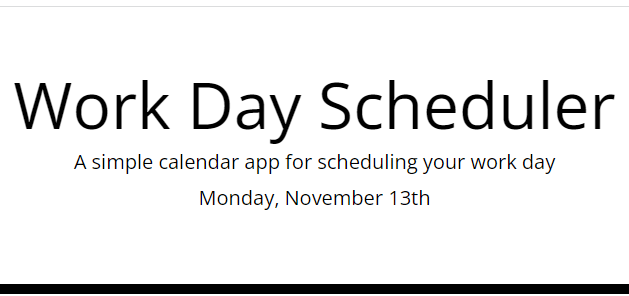
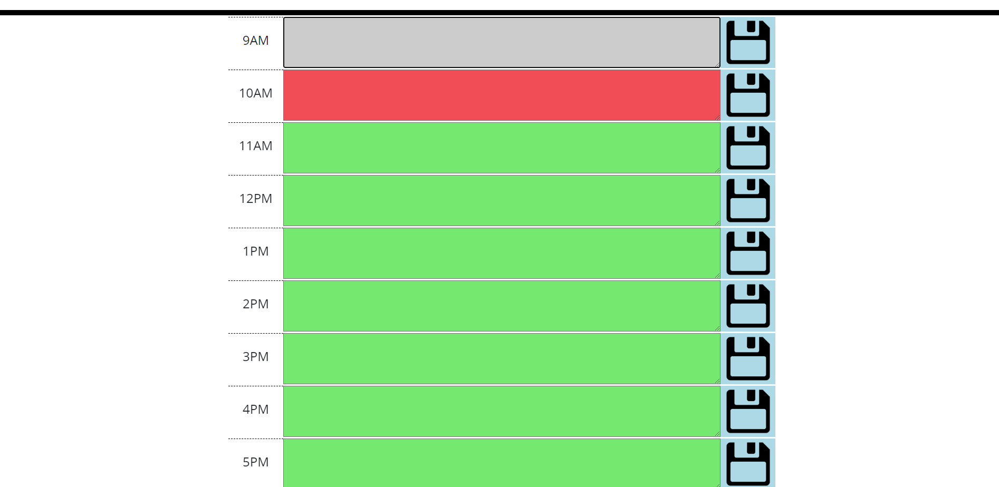
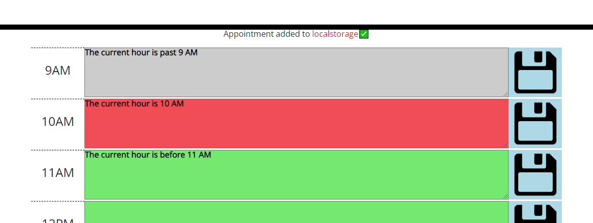
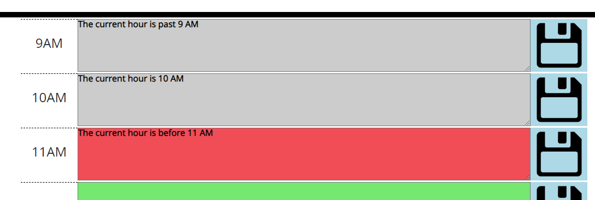

# Planner App

## Table of Contents
* [Screenshot of page](#screenshot)
* [Information](#information)
* [Installation](#installation)
* [License](#license)
* [Tests](#tests)

## Screenshot

## Information
The top of this page contains a header
The header contains the current day and date, which is updated every time the day changes
The time blocks are placed underneath the header
There is a time block for every hour between 9 AM and 5 PM
The text box of any hours before the current hour are coloured grey. The text box of the current hour is red. The text box of any colours after the current hour are green
The user can type into any of the text boxes and type as many lines of text as needed
When the save button is clicked, a message will appear at the top of all of the text boxes, informing that the message has been saved
Any messages that have been saved will remain on the page, on the same browser even after the browser has been closed

## Installation
Click on this link: https://programmer90000.github.io/planner-app/

## License
GNU GENERAL PUBLIC LICENSE (GPL) version 3.0

## Tests
Change the date and day on your computer. Check if the day and date on the header also updates
Change the hour on your computer. Check if the colour of the text boxes changes
Enter text into each text box
Click the save button on the right side of every text box
Refresh the page to see if the text remains or is removed
Change the text in each text box, click on the save button on the right side of every text box and refresh the page to see if the content has updated
Change the text in each text box. Do not click on the save button on the right side of every text box and refresh the page to see if the content has updated
Ensure a message appears at the top of all of the text boxes for a few seconds each time any one of the save buttons is pressed
